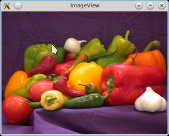
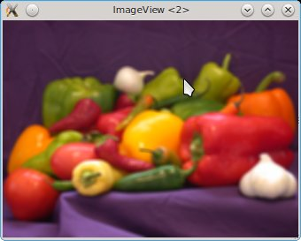
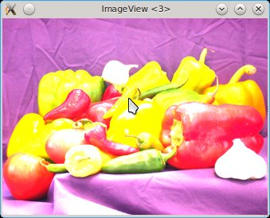
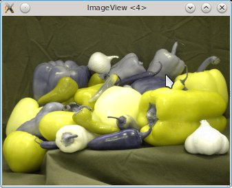

# Getting started

For these examples you'll need to install both `Images` and `ImageView`.
Load the code for these packages with

```julia
using Images
using ImageView
```

## Image I/O

You likely have a number of images already at your disposal; alternatively, install the [TestImages](https://github.com/timholy/TestImages.jl) package.
You can also retrieve a collection by running `readremote.jl` in the `test/` directory.
(This requires an internet connection.)
These will be deposited inside an `Images` directory inside your temporary directory
(e.g., `/tmp` on Linux systems).

Read an image from a file:
```
julia> img = imread("rose.png")
RGB Image with:
  data: 3x70x46 Uint8 Array
  properties:
    colordim: 1
    spatialorder: ["x", "y"]
    colorspace: RGB
```
Let's look at the properties:

- `colordim: 1` indicates that the first dimension of the array is used to store color information
- `spatialorder: ["x", "y"]` indicates that, after color, the image data are in "horizontal-major" order, meaning that a pixel at spatial location `(x,y)` would be addressed as `img[:,x,y]`. `["y", "x"]` would indicate vertical-major.
- `colorspace: RGB` indicates that color is represented as an RGB triple

Note that the image was loaded in "non-permuted" form, i.e., following the direct representation on disk.
If you prefer to work with plain arrays, you can convert it:
```
julia> imA = convert(Array, img);

julia> summary(imA)
"46x70x3 Uint8 Array"
```
You can see that this permuted the dimensions into the vertical-major, color-last order typical of Matlab.

Writing works similarly (and as with all `Images` functions, it accepts both plain arrays and `Image` types):
```
julia> imwrite(img, "rose2.jpg")
```
The image file type is inferred from the extension.

## Image display

The most direct approach is the `display` command:
```
julia> ImageView.display(img)
```
For further information see the [ImageView](https://github.com/timholy/ImageView.jl) documentation.

## Working with images: some examples

Here's a short example that may help you get started:
```
using Images, ImageView, Color
img = imread("peppers.png")           # an RGB image (you can pick anything)
kern = ones(7,7)/49;                  # a boxcar smoothing filter
imgf = imfilter(img, kern)
ImageView.display(img)
ImageView.display(imgf)
clp = ClipMinMax(Uint8, 0.0, 255.0)
imgc = scale(clp,3*float64(img))      # generate an oversaturated image
ImageView.display(imgc)
imgp = permutedims(img,[2,3,1])       # so we don't have to call squeeze() next
O = Overlay((imgp["color",2],imgp["color",1]),(RGB(0,0,1),RGB(1,1,0)),((0,255),(0,255)))
ImageView.display(O,xy=["y","x"])
```








